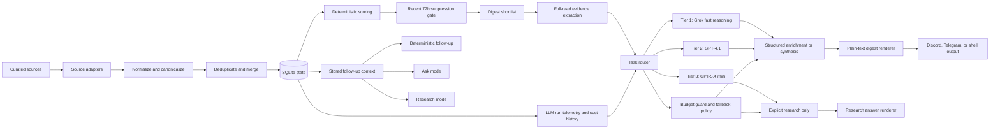
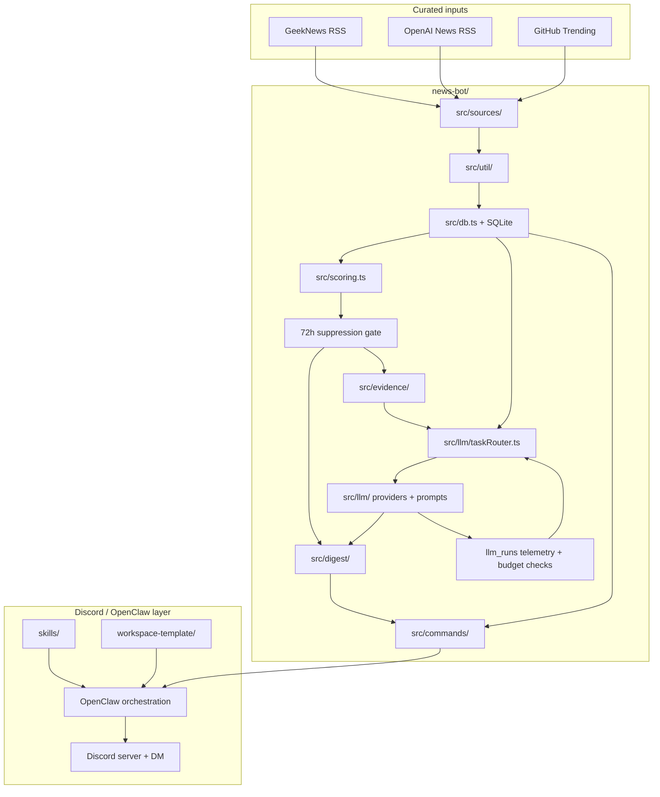

<div align="center">

# OpenSec

**A Discord-first personal control plane with deterministic multi-profile news briefs**

Curated sources in. Ranked Korean digests out. Optional LLM enrichment on top of a local, evidence-preserving core. One visible coordinator on Discord, with execution, research, and memory-distillation lanes behind it.

[Korean README](./README_KR.md) • [Architecture](./ARCHITECTURE.md) • [Product Engine](./news-bot/README.md) • [DB Schema](./docs/generated/db-schema.md)

</div>

## Why OpenSec

OpenSec is built around a simple rule:

> The daily digest should come from deterministic retrieval and scoring, not from unconstrained model browsing.

That design choice gives the system a few properties that are easy to lose in AI-heavy products:

- reproducible ranking
- debuggable local state
- preserved evidence and source attribution
- safe non-LLM fallbacks
- follow-up answers grounded in stored context

If an LLM is available, it improves explanation quality. If it is not, the digest should still ship.

## Highlights

| Capability | What it means |
| --- | --- |
| Deterministic daily digest | Curated sources, normalization, dedupe, SQLite state, explicit scoring |
| Evidence preserved by default | Canonical URL, source labels, source links, and score reasons stay attached |
| Multi-profile engine | Separate `tech` and `finance` profiles can share evidence but keep different digest context |
| Discord-first control plane | Workspace assets target a private Discord server with one front door |
| Plain-text digest output | Digest text stays channel-safe for Discord, Telegram, or shell delivery |
| Optional LLM layer | Item enrichment, theme synthesis, ask-mode explanation, and opt-in research |
| Daily memory loop | Discord conversations can be distilled into daily notes first, then promoted into curated long-term memory |
| Private control plane support | Includes OpenClaw workspace assets for Discord-first operations and DM approvals |

## How It Works



The important boundary is the placement of the LLM layer:

- retrieval stays deterministic
- recent 72h duplicate suppression happens before section assembly
- candidate generation stays bounded
- enrichment happens downstream of scoring and evidence extraction
- model selection is routed by task tier, not by ad hoc call-site choices
- delivery still works when enrichment is unavailable

## System Architecture



## What Is Implemented Today

OpenSec already includes:

- curated source ingestion
- profile-aware digest generation for `tech` and `finance`
- normalization, canonicalization, and deduplication
- precision and early-warning sourcing layers
- SQLite-backed local state
- deterministic ranking and resend suppression
- Korean digest rendering
- digest follow-up commands over stored context
- optional LLM item enrichment and theme synthesis
- `ask` follow-ups over stored evidence
- `research` follow-ups with bounded live search and cited links
- OpenClaw workspace bootstrap assets for private Discord use
- daily note capture and memory-distillation scaffolding for Discord conversations

Still planned or evolving:

- LLM rerank calibration
- richer Discord thread delegation and standing orders
- further VPS and automation hardening

## Supported Sources

The default adapters currently cover:

`tech`

- OpenAI News RSS
- GitHub Trending
- GeekNews
- Techmeme
- Hacker News
- Bluesky watchlist signals
  - early-warning only
  - disabled by default

`finance`

- Federal Reserve press
- SEC press
- Treasury press
- BLS releases
  - CPI
  - Jobs
  - PPI
  - ECI
- major-company SEC filings

## Discord Operating Model

| Lane | Purpose | Typical requests |
| --- | --- | --- |
| `#assistant` | Front door for triage and lightweight help | general requests, routing, quick answers |
| `#tech-brief` | Scheduled `tech` digest plus short follow-up | `expand 2`, `show sources for 2`, short `ask` |
| `#finance-brief` | Scheduled `finance` digest plus short follow-up | macro summary, source lookup, short `ask` |
| `#research` | Longer explanation and explicit live research | `research look deeper into item 2` |
| `#coding` | Repo work, tests, and execution requests | `run tests`, `open a branch`, `fix this file` |
| `DM` | Sensitive approvals and private escalations | approvals, secrets, private preferences |

For a solo private guild, it is reasonable to start with `requireMention: true` and later switch it to `false` once routing and permissions are stable.

## Memory Loop

OpenSec does not dump every Discord message straight into long-term memory.

Instead, the workspace is set up to use a two-step memory flow:

- raw or semi-structured notes go into `memory/YYYY-MM-DD.md`
- stable preferences, durable facts, and recurring operating rules get curated into `MEMORY.md`

Supporting assets live in:

- [`skills/memory_ops/`](./skills/memory_ops)
- [`scripts/ensure-daily-memory-note.sh`](./scripts/ensure-daily-memory-note.sh)
- [`workspace-template/memory/README.md`](./workspace-template/memory/README.md)

Heartbeat is still intentionally conservative. The current posture is "capture first, distill deliberately" rather than silently auto-promoting conversation fragments into durable memory.

## Follow-up Modes

| Mode | Example | Notes |
| --- | --- | --- |
| Deterministic | `openai only` | Filters the latest digest context to OpenAI-related items |
| Deterministic | `repo radar` | Shows repo-oriented items from stored digest context |
| Deterministic | `today themes` | Returns the latest stored theme bullets |
| Deterministic | `expand 2` | Uses the latest stored digest only |
| Deterministic | `show sources for 2` | Returns preserved evidence links |
| Deterministic | `why important 2` | Explains score reasoning from saved context |
| Ask | `ask summarize only today's OpenAI items` | Uses stored digest evidence, with LLM help when available |
| Research | `research look deeper into item 2` | Explicit opt-in live research with cited links |

## Repository Map

| Path | Purpose |
| --- | --- |
| `news-bot/` | Product engine for ingestion, state, scoring, digest rendering, and follow-ups |
| `skills/` | OpenClaw-facing workspace skills |
| `docs/design-docs/` | Long-lived design beliefs and architecture notes |
| `docs/product-specs/` | User-visible behavior specs |
| `docs/exec-plans/` | Active and completed execution plans |
| `docs/generated/` | Derived references such as the SQLite schema |
| `scripts/` | Workspace bootstrap and operations scripts |
| `workspace-template/` | Base personal workspace scaffold for OpenClaw |

## Quick Start

### 1. Run the news engine locally

```bash
cd ./news-bot
pnpm install
pnpm approve-builds
cp .env.example .env
pnpm test
pnpm digest -- --profile tech --mode am
pnpm digest -- --profile finance --mode am
pnpm followup -- --profile tech "expand 1"
```

If `pnpm approve-builds` prompts for native packages, approve `better-sqlite3` and `esbuild`.

Useful local commands:

```bash
pnpm --dir ./news-bot fetch
pnpm --dir ./news-bot digest -- --profile tech --mode am
pnpm --dir ./news-bot digest -- --profile tech --mode pm
pnpm --dir ./news-bot digest -- --profile finance --mode am
pnpm --dir ./news-bot digest -- --profile finance --mode pm
pnpm --dir ./news-bot dry-run:am
pnpm --dir ./news-bot dry-run:pm
pnpm --dir ./news-bot followup -- --profile tech "openai only"
pnpm --dir ./news-bot followup -- --profile tech "repo radar"
pnpm --dir ./news-bot followup -- --profile tech "today themes"
pnpm --dir ./news-bot followup -- --profile tech "show sources for 2"
pnpm --dir ./news-bot followup -- --profile tech "ask summarize today's OpenAI items"
pnpm --dir ./news-bot followup -- --profile finance "ask summarize today's macro items"
pnpm --dir ./news-bot followup -- --profile tech "research look deeper into item 2"
```

### 2. Configure environment variables

For local CLI use, the defaults are enough to get started.

For real Discord and OpenClaw delivery, fill in:

- your Discord bot token in the OpenClaw config
- your Discord server and channel IDs in the OpenClaw config
- your owner Discord user ID for allowlists and DM approvals

Telegram variables are only needed if you keep Telegram as a fallback delivery surface:

- `NEWS_BOT_TELEGRAM_USER_ID`
- `TELEGRAM_BOT_TOKEN`

Optional LLM variables:

- `OPENAI_API_KEY`
- `NEWS_BOT_DEFAULT_PROFILE`
- `NEWS_BOT_LLM_ENABLED`
- `NEWS_BOT_LLM_THEMES_ENABLED`
- `NEWS_BOT_LLM_MODEL_SUMMARY`
- `NEWS_BOT_LLM_MODEL_THEMES`
- `NEWS_BOT_LLM_MODEL_RESEARCH`

### 3. Turn it into a private Discord control plane

This repository also ships the assets needed to run OpenSec inside a private OpenClaw workspace.

Key files:

- [`openclaw.personal.example.jsonc`](./openclaw.personal.example.jsonc)
- [`scripts/setup-personal-workspace.sh`](./scripts/setup-personal-workspace.sh)
- [`scripts/ensure-daily-memory-note.sh`](./scripts/ensure-daily-memory-note.sh)
- [`workspace-template/`](./workspace-template)
- [`skills/ai_news_brief/`](./skills/ai_news_brief)
- [`skills/code_ops/`](./skills/code_ops)
- [`skills/memory_ops/`](./skills/memory_ops)
- [`skills/repo_ops/`](./skills/repo_ops)
- [`skills/system_ops/`](./skills/system_ops)

Bootstrap the workspace with:

```bash
bash ./scripts/setup-personal-workspace.sh
```

Then:

1. copy the example OpenClaw config
2. fill in your Discord bot token, server ID, channel IDs, and owner ID
3. start the OpenClaw gateway
4. bind Discord to the main agent with `openclaw agents bind --agent main --bind discord`
5. point OpenClaw at the personal workspace that includes these skills
6. install the Discord cron jobs for `#tech-brief` and `#finance-brief`
7. scaffold the first daily note with `bash ./scripts/ensure-daily-memory-note.sh`

## Design Principles

The non-negotiables for this repository are straightforward:

- do not make daily digest generation depend on freeform live web search
- keep LLMs downstream of deterministic retrieval
- always preserve a non-LLM fallback path
- preserve original evidence and scoring context
- prefer official sources over commentary
- silence is better than filler

## Documentation Guide

Recommended reading order:

1. [`ARCHITECTURE.md`](./ARCHITECTURE.md)
2. [`news-bot/README.md`](./news-bot/README.md)
3. [`docs/generated/db-schema.md`](./docs/generated/db-schema.md)
4. [`docs/product-specs/llm-assisted-digest.md`](./docs/product-specs/llm-assisted-digest.md)
5. [`docs/product-specs/discord-personal-control-plane.md`](./docs/product-specs/discord-personal-control-plane.md)
6. [`docs/product-specs/telegram-news-followup-and-research.md`](./docs/product-specs/telegram-news-followup-and-research.md)
7. [`docs/design-docs/openclaw-personal-control-plane.md`](./docs/design-docs/openclaw-personal-control-plane.md)

Current execution work lives under [`docs/exec-plans/active/`](./docs/exec-plans/active).

## Contributing

If you want to contribute, this is the shortest accurate mental model:

- `news-bot/` is the product engine
- `skills/` and `workspace-template/` are the operating interface
- `docs/` is the durable memory for future contributors

For meaningful architecture changes, update all of the following:

1. [`ARCHITECTURE.md`](./ARCHITECTURE.md)
2. the relevant plan under [`docs/exec-plans/active/`](./docs/exec-plans/active)
3. [`docs/generated/db-schema.md`](./docs/generated/db-schema.md) if schema changed
4. tests for ranking, rendering, or follow-up behavior

Recommended validation:

```bash
pnpm --dir ./news-bot test
pnpm --dir ./news-bot digest -- --profile tech --mode am
pnpm --dir ./news-bot digest -- --profile finance --mode am
```

## Who This Repo Is For

OpenSec is a strong fit if you want:

- a private AI news digest for one owner
- Discord as the front door
- deterministic retrieval with optional LLM explanation
- preserved source evidence instead of opaque agent behavior
- a repo that doubles as both product code and operations scaffold

It is not optimized for:

- fully autonomous browsing-first agents
- multi-tenant SaaS productization
- model-only ranking with no stored evidence trail
