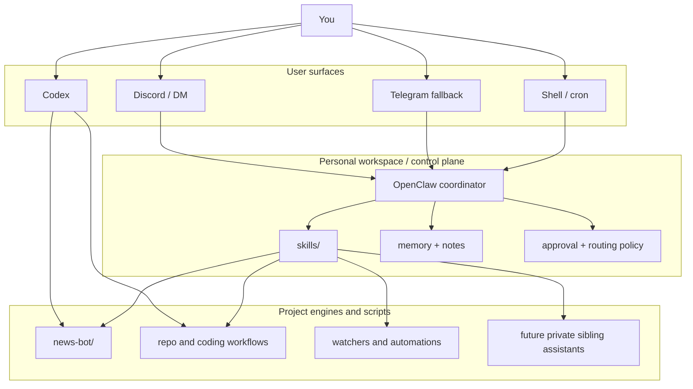

<div align="center">

# OpenSec

**Single-owner personal AI assistant workspace for news, research, coding, and automation**

Deterministic engines where they matter. Bounded LLM help where it adds leverage. One workspace that can grow from a news brief into a real personal control plane.

[Korean README](./README_KR.md) • [Architecture](./ARCHITECTURE.md) • [News Engine](./news-bot/README.md) • [DB Schema](./docs/generated/db-schema.md)

</div>

## What OpenSec Is

OpenSec is not just a news bot.

It is a public-safe foundation for a single-owner personal assistant system:

- `news-bot/` gives you deterministic news and signal pipelines
- `skills/` gives OpenClaw structured entry points for news, repo work, coding, memory, and system tasks
- `workspace-template/` gives you a long-lived personal workspace shape
- `docs/` keeps the architecture, plans, and product memory durable

The core idea is simple:

> treat retrieval, state, and operations as first-class system components, not as side effects of one big prompt

That lets the repo support more than one use case:

- scheduled briefs
- bounded follow-up research
- repo and coding tasks
- memory capture and distillation
- small personal automations
- future private sibling assistants, such as a training bot, without collapsing everything into one hidden prompt

## The Stack

Think of the system in three layers:

| Layer | Role | Examples |
| --- | --- | --- |
| Front doors | Where you talk to the system | Discord, Telegram fallback, shell, Codex |
| Workspace control plane | Routing, approvals, memory, skills, cron | OpenClaw workspace, `skills/`, `workspace-template/` |
| Deterministic engines and scripts | Actual domain logic | `news-bot/`, watcher flows, repo scripts, future project engines |

Practical interpretation:

- OpenClaw is the always-on gateway and coordinator
- Codex is a direct coding/operator surface against the same repo
- this repository contains the engines, skills, scripts, and docs that make those surfaces useful

## What You Can Do Today

| Capability lane | What exists now |
| --- | --- |
| Daily news brief | Deterministic `tech` and `finance` digests with SQLite state, scoring, resend suppression, and Korean rendering |
| Follow-up Q&A | `expand N`, `show sources for N`, `today themes`, `ask <질문>`, `research <질문>` |
| Repo and coding work | `code_ops`, `repo_ops`, and `system_ops` skill scaffolds for controlled remote execution |
| Memory loop | Daily note capture and curated long-term memory flow through `workspace-template/` and `skills/memory_ops/` |
| Specialized automation | Separate bounded runtimes such as the Xiaohongshu housing watcher |
| Cost-aware LLM use | Task-tiered routing, usage telemetry, and budget controls in the news engine |
| Safe extension path | New skills, scripts, and deterministic engines can be added without redesigning the whole system |

## Mental Model



The important point is that `news-bot/` is one engine inside a broader personal assistant shape.

## Design Stance

These are the repository-level design choices:

- deterministic retrieval before model enrichment
- local state and evidence preserved in SQLite
- non-LLM fallback must remain usable
- one visible coordinator is better than many visible bots
- skills and scripts should expose bounded actions instead of prompt-only magic
- future private assistants should live beside this repo, not be smuggled into it

This is why the news system is structured the way it is:

- daily candidate discovery is deterministic
- dedupe and resend suppression happen in the data layer
- full-read article context is cached locally
- LLM calls are routed by task tier
- follow-up answers can reuse stored evidence instead of starting from zero

The same philosophy also makes the repo usable for non-news work.

## Why This Structure Scales

OpenSec is meant to grow with the owner.

Typical progression:

1. Start with local digest generation.
2. Add OpenClaw and a private Discord front door.
3. Add repo and system skills for remote work.
4. Add memory capture and daily distillation.
5. Add more bounded automations or private sibling assistants.

Because the workspace, skills, engines, and docs are separated, new capabilities do not need to be bolted onto the news prompt itself.

Examples of clean extension paths:

- add a new deterministic engine under `projects/` or this repo
- add a new skill under `skills/`
- add a new bounded automation script under `scripts/`
- add a private sibling workspace or private repo for a training bot, while keeping this public repo clean

## Repository Map

| Path | Purpose |
| --- | --- |
| `news-bot/` | Deterministic news engine with scoring, evidence, follow-up, LLM routing, and delivery-friendly rendering |
| `skills/` | OpenClaw-facing skills for news, code, repo, memory, and system tasks |
| `workspace-template/` | Base personal workspace scaffold, including memory files and operator documents |
| `scripts/` | Workspace bootstrap, daily note helpers, VPS bootstrap, and other operational scripts |
| `docs/design-docs/` | Long-lived system design notes |
| `docs/product-specs/` | Product behavior and operating model specs |
| `docs/exec-plans/` | Active and completed implementation plans |
| `docs/generated/` | Derived references such as the database schema |

## Current Engines And Lanes

### 1. News engine

`news-bot/` currently provides:

- source adapters for curated feeds
- normalization, canonicalization, and dedupe
- SQLite-backed raw items, normalized items, digests, follow-up context, and telemetry
- deterministic ranking
- recent 72-hour resend suppression
- full-read article or repo context extraction
- Korean digest rendering
- bounded LLM enrichment and research

### 2. Workspace skills

The current public workspace skills are:

- [`skills/ai_news_brief/`](./skills/ai_news_brief/)
- [`skills/code_ops/`](./skills/code_ops/)
- [`skills/repo_ops/`](./skills/repo_ops/)
- [`skills/memory_ops/`](./skills/memory_ops/)
- [`skills/system_ops/`](./skills/system_ops/)

These are intentionally simple, explicit entry points. The goal is to make remote execution understandable and auditable.

### 3. Memory loop

The memory model is deliberately conservative:

- raw daily notes go into `memory/YYYY-MM-DD.md`
- stable preferences and durable operating facts go into `MEMORY.md`

OpenSec does not assume every conversation should become long-term memory.

### 4. Private extensions

This public repo is designed to coexist with private siblings.

For example:

- a private training bot
- private owner memory
- private operational exports
- private secrets and hidden rules

Those should live in a separate private workspace or private repo, not inside OpenSec itself.

## OpenClaw And Codex

If you are using both OpenClaw and Codex, the clean boundary is:

| Tool | Best use |
| --- | --- |
| OpenClaw | Always-on gateway, Discord/DM front door, approvals, cron, memory, tool orchestration |
| Codex | Direct implementation work inside the repo, code edits, debugging, tests, documentation updates |
| OpenSec repo | Shared system of record for deterministic logic, skills, scripts, and docs |

That means:

- you can run the repo locally with Codex and shell only
- you can also mount the same repo under an OpenClaw workspace for always-on assistant behavior
- you do not need to choose between "news bot" and "coding assistant"; the same workspace can support both

## Quick Start

### 1. Run the deterministic engine locally

```bash
cd ./news-bot
pnpm install
pnpm approve-builds
cp .env.example .env
pnpm test
pnpm digest -- --profile tech --mode am
pnpm followup -- --profile tech "expand 1"
```

If `pnpm approve-builds` prompts for native packages, approve `better-sqlite3` and `esbuild`.

### 2. Bootstrap the personal workspace

```bash
bash ./scripts/setup-personal-workspace.sh
```

That sets up the base workspace shape used by OpenClaw:

- operator documents
- memory files
- public skills
- expected project layout

### 3. Attach it to OpenClaw

Key files:

- [`openclaw.personal.example.jsonc`](./openclaw.personal.example.jsonc)
- [`scripts/setup-personal-workspace.sh`](./scripts/setup-personal-workspace.sh)
- [`scripts/ensure-daily-memory-note.sh`](./scripts/ensure-daily-memory-note.sh)
- [`workspace-template/`](./workspace-template/)

Then:

1. copy the example OpenClaw config
2. fill in your Discord or Telegram credentials
3. start the OpenClaw gateway
4. point it at the personal workspace
5. bind channels and approvals
6. install cron jobs or recurring automations

## Suggested Reading Order

1. [`ARCHITECTURE.md`](./ARCHITECTURE.md)
2. [`news-bot/README.md`](./news-bot/README.md)
3. [`docs/generated/db-schema.md`](./docs/generated/db-schema.md)
4. [`docs/design-docs/openclaw-personal-control-plane.md`](./docs/design-docs/openclaw-personal-control-plane.md)
5. [`docs/product-specs/discord-personal-control-plane.md`](./docs/product-specs/discord-personal-control-plane.md)
6. [`docs/product-specs/llm-assisted-digest.md`](./docs/product-specs/llm-assisted-digest.md)

## Who This Repo Is For

OpenSec is a fit if you want:

- a single-owner assistant system, not a multi-tenant SaaS
- deterministic engines plus bounded LLM help
- one workspace that can cover news, research, coding, and automation
- direct evidence and local state instead of opaque browsing-only behavior
- a public-safe repo that can sit next to private sibling assistants

It is not trying to be:

- an unconstrained autonomous browsing agent
- a general SaaS chatbot backend
- a pure prompt-only system with no persistent operational state
