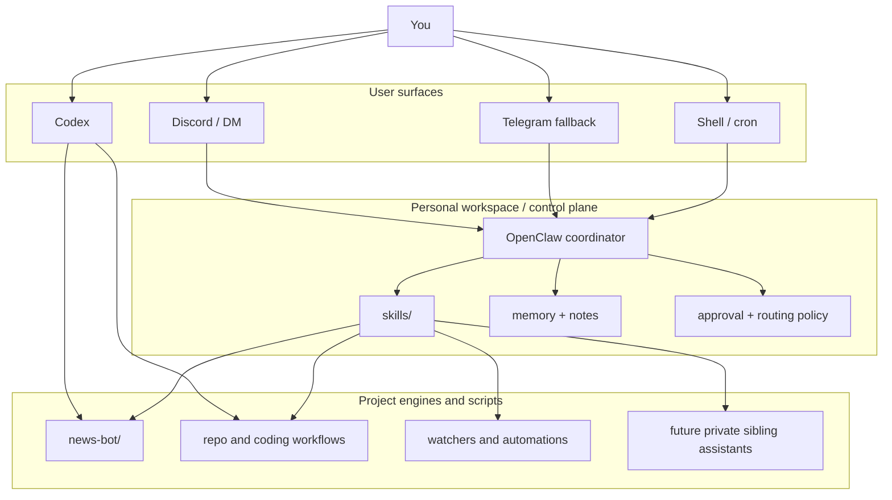

<div align="center">

# OpenSec

**뉴스, 리서치, 코딩, 자동화를 위한 single-owner personal AI assistant workspace**

deterministic해야 하는 부분은 deterministic engine으로 두고, 레버리지가 큰 지점에만 bounded LLM을 붙입니다. 작은 뉴스 브리프에서 시작해도, 결국은 실제 개인 control plane으로 확장될 수 있는 구조를 목표로 합니다.

[English README](./README.md) • [아키텍처](./ARCHITECTURE.md) • [뉴스 엔진](./news-bot/README.md) • [DB 스키마](./docs/generated/db-schema.md)

</div>

## OpenSec는 무엇인가

OpenSec는 단순한 뉴스 봇 저장소가 아닙니다.

이 저장소는 한 명의 owner를 위한 personal assistant system의 public-safe foundation입니다.

- `news-bot/`은 deterministic한 뉴스/시그널 엔진입니다.
- `skills/`는 OpenClaw가 사용할 명시적인 작업 entry point입니다.
- `workspace-template/`는 장기적으로 유지되는 personal workspace의 기본 형태입니다.
- `docs/`는 설계 원칙, 실행 계획, 제품 문서를 장기 기억처럼 보존하는 계층입니다.

핵심 아이디어는 단순합니다.

> retrieval, state, operations를 하나의 거대한 prompt의 부수효과로 처리하지 말고, 시스템 컴포넌트로 취급한다.

그래서 이 저장소는 뉴스 외에도 다음을 자연스럽게 지원할 수 있습니다.

- scheduled brief
- bounded follow-up research
- repo와 coding task
- memory capture와 distillation
- 작은 personal automation
- future private sibling assistant
  - 예: training bot

## 전체 구조

시스템은 크게 세 층으로 보는 것이 가장 정확합니다.

| 층 | 역할 | 예시 |
| --- | --- | --- |
| Front doors | 사용자가 말을 거는 표면 | Discord, Telegram fallback, shell, Codex |
| Workspace control plane | 라우팅, 승인, 메모리, skill, cron | OpenClaw workspace, `skills/`, `workspace-template/` |
| Deterministic engines / scripts | 실제 도메인 로직 | `news-bot/`, watcher, repo script, future project engine |

실제로는 이렇게 이해하면 됩니다.

- OpenClaw는 always-on gateway이자 coordinator입니다.
- Codex는 같은 repo를 직접 다루는 coding / operator surface입니다.
- 이 저장소는 그 위에서 돌아가는 engine, skill, script, doc를 담는 shared system of record입니다.

## 지금 이미 할 수 있는 것

| capability lane | 현재 구현된 것 |
| --- | --- |
| Daily news brief | SQLite state, scoring, resend suppression, Korean rendering이 있는 deterministic `tech` / `finance` digest |
| Follow-up Q&A | `expand N`, `show sources for N`, `today themes`, `ask <질문>`, `research <질문>` |
| Repo / coding work | `code_ops`, `repo_ops`, `system_ops` 기반의 bounded remote execution scaffold |
| Memory loop | `workspace-template/`와 `skills/memory_ops/` 기반의 daily note + curated memory 흐름 |
| Specialized automation | Xiaohongshu housing watcher 같은 별도 bounded runtime |
| Cost-aware LLM use | task-tiered routing, usage telemetry, budget control |
| Global token audit | OpenClaw session 전역 + direct app `llm_runs`를 하나의 ledger로 수집 |
| Safe extension path | 새 skill, script, deterministic engine을 시스템을 깨지 않고 추가 가능 |

## Mental Model



중요한 포인트는 `news-bot/`이 전체 assistant 구조 안의 한 엔진이라는 점입니다.

## 설계 관점

저장소 레벨의 설계 선택은 다음과 같습니다.

- deterministic retrieval을 model enrichment보다 앞에 둡니다.
- evidence와 local state를 SQLite에 보존합니다.
- non-LLM fallback이 항상 살아 있어야 합니다.
- visible bot은 여러 개보다 하나의 coordinator가 낫습니다.
- skill과 script는 prompt-only magic이 아니라 bounded action을 노출해야 합니다.
- future private assistant는 이 repo 안에 숨겨 넣지 않고, 옆의 private sibling으로 둡니다.

이 원칙이 뉴스 시스템에도 그대로 반영됩니다.

- daily candidate discovery는 deterministic합니다.
- dedupe와 resend suppression은 data layer에서 처리합니다.
- full-read article context는 local cache에 저장합니다.
- LLM call은 task tier로 라우팅합니다.
- follow-up answer는 저장된 evidence를 재사용합니다.

같은 철학 덕분에 이 repo는 뉴스 이외의 작업에도 자연스럽게 확장됩니다.

## 왜 이 구조가 확장에 유리한가

OpenSec는 owner와 함께 커지도록 설계되어 있습니다.

보통은 다음 순서로 확장됩니다.

1. 로컬 digest generation으로 시작
2. OpenClaw와 private Discord front door 추가
3. repo / system skill 추가
4. memory capture와 daily distillation 추가
5. 더 많은 bounded automation이나 private sibling assistant 추가

workspace, skills, engines, docs가 분리되어 있기 때문에 새 capability를 뉴스 prompt 안에 우겨 넣지 않아도 됩니다.

깔끔한 확장 예시는 다음과 같습니다.

- 새 deterministic engine을 `projects/` 또는 이 repo 아래에 추가
- 새 skill을 `skills/` 아래에 추가
- 새 bounded automation script를 `scripts/` 아래에 추가
- private training bot용 private workspace 또는 private repo를 별도로 추가

## 저장소 구조

| 경로 | 역할 |
| --- | --- |
| `news-bot/` | scoring, evidence, follow-up, LLM routing, channel-friendly rendering을 포함한 deterministic news engine |
| `skills/` | OpenClaw에서 사용하는 뉴스, 코드, repo, memory, system task용 skill |
| `workspace-template/` | memory file과 operator document를 포함한 personal workspace scaffold |
| `scripts/` | workspace bootstrap, daily note helper, VPS bootstrap 등 운영 script |
| `docs/design-docs/` | 장기적인 system design note |
| `docs/product-specs/` | 사용자 관점의 동작 명세 |
| `docs/exec-plans/` | active / completed implementation plan |
| `docs/generated/` | DB schema 같은 derived reference |

## 현재 엔진과 작업 lane

### 1. News engine

`news-bot/`은 현재 다음을 제공합니다.

- curated feed adapter
- normalization, canonicalization, dedupe
- SQLite-backed raw item / normalized item / digest / follow-up context / telemetry
- deterministic ranking
- 최근 72시간 resend suppression
- article / repo full-read context extraction
- Korean digest rendering
- bounded LLM enrichment와 research

### 2. Workspace skills

현재 public workspace skill은 다음과 같습니다.

- [`skills/ai_news_brief/`](./skills/ai_news_brief/)
- [`skills/code_ops/`](./skills/code_ops/)
- [`skills/repo_ops/`](./skills/repo_ops/)
- [`skills/memory_ops/`](./skills/memory_ops/)
- [`skills/system_ops/`](./skills/system_ops/)

의도는 단순합니다. remote execution을 이해 가능하고 audit 가능하게 유지하는 것입니다.

### 3. Memory loop

메모리 모델은 의도적으로 보수적입니다.

- raw daily note는 `memory/YYYY-MM-DD.md`
- 안정된 선호와 durable operating fact는 `MEMORY.md`

모든 대화를 바로 장기 기억으로 승격시키지 않습니다.

### 4. Private extension

이 public repo는 private sibling과 공존하도록 설계되어 있습니다.

예를 들어:

- private training bot
- private owner memory
- private operational export
- secret과 hidden rule

이런 것들은 OpenSec 안에 직접 넣는 것이 아니라 private workspace 또는 private repo로 분리하는 것이 맞습니다.

## OpenClaw와 Codex의 역할

둘 다 쓸 때의 경계는 다음처럼 잡는 것이 가장 깔끔합니다.

| 도구 | 가장 잘하는 일 |
| --- | --- |
| OpenClaw | always-on gateway, Discord/DM front door, approval, cron, memory, tool orchestration |
| Codex | repo 내부 직접 구현, 코드 수정, 디버깅, 테스트, 문서 업데이트 |
| OpenSec repo | deterministic logic, skill, script, doc를 담는 shared system of record |

즉:

- Codex + shell만으로도 로컬 실행이 가능합니다.
- 같은 repo를 OpenClaw workspace 아래 붙이면 always-on assistant로도 쓸 수 있습니다.
- `news bot`과 `coding assistant` 중 하나만 택할 필요가 없습니다.

## 빠른 시작

### 1. deterministic engine 로컬 실행

```bash
cd ./news-bot
pnpm install
pnpm approve-builds
cp .env.example .env
pnpm test
pnpm digest -- --profile tech --mode am
pnpm followup -- --profile tech "expand 1"
```

`pnpm approve-builds`에서 native package 허용이 필요하면 `better-sqlite3`와 `esbuild`를 승인하면 됩니다.

### 2. personal workspace bootstrap

```bash
bash ./scripts/setup-personal-workspace.sh
```

이 스크립트는 OpenClaw가 쓰게 될 기본 workspace 형태를 준비합니다.

- operator document
- memory file
- public skill
- expected project layout

### 3. OpenClaw에 연결

핵심 파일:

- [`openclaw.personal.example.jsonc`](./openclaw.personal.example.jsonc)
- [`scripts/setup-personal-workspace.sh`](./scripts/setup-personal-workspace.sh)
- [`scripts/ensure-daily-memory-note.sh`](./scripts/ensure-daily-memory-note.sh)
- [`workspace-template/`](./workspace-template/)

그 다음:

1. example OpenClaw config 복사
2. Discord 또는 Telegram credential 입력
3. OpenClaw gateway 시작
4. personal workspace 연결
5. channel / approval binding 설정
6. cron 또는 recurring automation 등록

## 추천 문서 순서

1. [`ARCHITECTURE.md`](./ARCHITECTURE.md)
2. [`news-bot/README.md`](./news-bot/README.md)
3. [`docs/generated/db-schema.md`](./docs/generated/db-schema.md)
4. [`docs/design-docs/openclaw-personal-control-plane.md`](./docs/design-docs/openclaw-personal-control-plane.md)
5. [`docs/product-specs/discord-personal-control-plane.md`](./docs/product-specs/discord-personal-control-plane.md)
6. [`docs/product-specs/llm-assisted-digest.md`](./docs/product-specs/llm-assisted-digest.md)

## 이 저장소가 잘 맞는 경우

OpenSec는 다음과 같은 경우에 적합합니다.

- multi-tenant SaaS가 아니라 single-owner assistant system이 필요할 때
- deterministic engine과 bounded LLM help를 같이 쓰고 싶을 때
- 뉴스, 리서치, 코딩, 자동화를 한 workspace에서 다루고 싶을 때
- opaque browsing-only agent보다 local state와 evidence를 더 중요하게 볼 때
- public-safe repo와 private sibling assistant를 같이 운영하고 싶을 때

반대로 이 저장소는 다음을 목표로 하지 않습니다.

- unconstrained autonomous browsing agent
- general SaaS chatbot backend
- persistent operational state가 없는 pure prompt-only system
