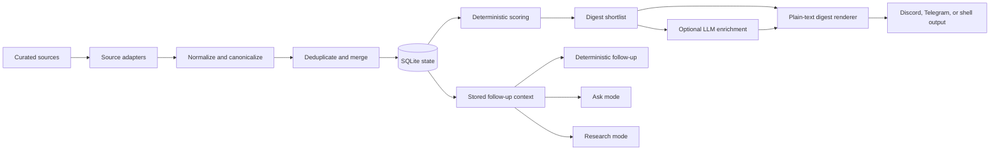
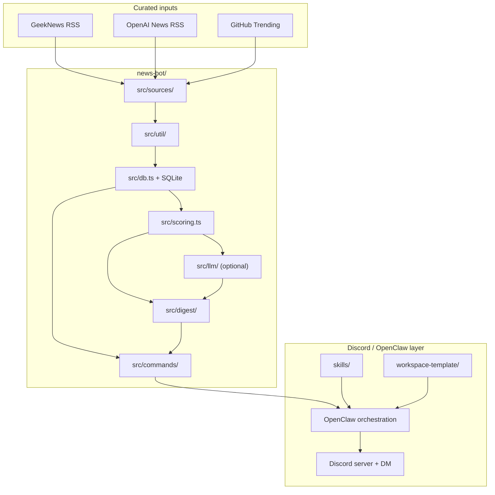

<div align="center">

# OpenSec

**Discord 기반 personal control plane과 deterministic multi-profile 뉴스 브리프**

Curated source를 수집하고, 로컬 상태를 기준으로 우선순위를 정하고, 한국어 digest를 만들고, 필요할 때만 LLM을 설명 레이어로 붙입니다. Discord에서는 보이는 coordinator 하나를 front door로 두고, 그 뒤에 coding, research, memory-distillation lane을 둡니다.

[English README](./README.md) • [아키텍처](./ARCHITECTURE.md) • [뉴스 엔진](./news-bot/README.md) • [DB 스키마](./docs/generated/db-schema.md)

</div>

## OpenSec는 무엇이 다른가

OpenSec의 핵심 원칙은 분명합니다.

> daily digest는 모델의 자유 탐색이 아니라 deterministic retrieval과 scoring에서 나와야 합니다.

이 원칙 덕분에 다음을 지킬 수 있습니다.

- 재현 가능한 ranking
- 디버깅 가능한 로컬 상태
- source attribution과 evidence 보존
- 안전한 non-LLM fallback
- 저장된 digest context에 근거한 follow-up

LLM이 있으면 설명 품질이 좋아지고, 없어도 digest는 계속 나가야 합니다.

## 핵심 특징

| 기능 | 의미 |
| --- | --- |
| Deterministic daily digest | curated source, normalization, dedupe, SQLite state, explicit scoring |
| Evidence preservation | canonical URL, source label, source links, score reasons를 유지 |
| Multi-profile engine | `tech`와 `finance` profile이 evidence를 공유하면서도 다른 digest context를 유지 |
| Discord-first control plane | private Discord server와 DM approval을 전제로 한 workspace 자산 포함 |
| Plain-text digest output | Discord, Telegram, shell 어디로도 전달 가능한 텍스트 digest |
| Optional LLM layer | item enrichment, theme synthesis, ask, research |
| Daily memory loop | Discord 대화를 바로 장기 기억으로 넣지 않고 daily note를 거쳐 curated memory로 올림 |
| Private control plane support | OpenClaw workspace 자산과 Discord 운영 흐름 포함 |

## 작동 원리



중요한 경계는 LLM의 위치입니다.

- retrieval은 deterministic하게 유지합니다.
- candidate generation은 bounded set으로 제한합니다.
- enrichment는 scoring 이후에만 붙습니다.
- enrichment 실패가 delivery를 막으면 안 됩니다.

## 전체 아키텍처



## 현재 구현된 범위

이미 포함된 기능:

- curated source ingestion
- `tech` / `finance` profile 기반 digest generation
- normalization, canonicalization, deduplication
- precision / early-warning sourcing layer
- SQLite 기반 상태 저장
- deterministic ranking과 resend suppression
- 한국어 digest 렌더링
- 저장된 context 기반 follow-up command
- optional LLM item enrichment와 theme synthesis
- stored evidence 기반 `ask`
- bounded live search와 cited links를 사용하는 `research`
- OpenClaw 개인 Discord 워크스페이스 bootstrap 자산
- Discord 대화를 위한 daily note capture와 memory distillation scaffold

아직 확장 중이거나 계획된 영역:

- LLM rerank calibration
- richer Discord thread delegation과 standing orders
- VPS 및 운영 자동화 고도화

## 지원 소스

`tech`

- OpenAI News RSS
- GitHub Trending
- GeekNews
- Techmeme
- Hacker News
- Bluesky watchlist signal
  - early-warning 전용
  - 기본값은 비활성

`finance`

- Federal Reserve press
- SEC press
- Treasury press
- BLS releases
  - CPI
  - Jobs
  - PPI
  - ECI
- major-company SEC filings

## Discord 운영 방식

| 채널 | 역할 | 보통 하는 일 |
| --- | --- | --- |
| `#assistant` | front door | 일반 질문, triage, 짧은 응답 |
| `#tech-brief` | `tech` digest 전용 채널 | `expand 2`, `show sources for 2`, 짧은 `ask` |
| `#finance-brief` | `finance` digest 전용 채널 | macro 요약, source 확인, 짧은 `ask` |
| `#research` | 장문 설명과 명시적 live research | `research 2번 더 찾아줘` |
| `#coding` | repo 작업과 실행 lane | 테스트, 브랜치, 파일 수정 요청 |
| `DM` | 민감한 승인과 private escalation | approvals, secrets, 개인 선호 |

1인용 private guild라면 처음에는 `requireMention: true`로 시작하고, 라우팅이 안정되면 `false`로 바꿔 멘션 없이 듣게 만드는 것이 자연스럽습니다.

## Memory 루프

OpenSec는 Discord 대화를 바로 장기 메모리에 던지지 않습니다.

대신 아래 2단계로 다룹니다.

- raw 또는 semi-structured note는 `memory/YYYY-MM-DD.md`
- 안정된 선호, 반복 규칙, durable fact는 `MEMORY.md`

지원 자산:

- [`skills/memory_ops/`](./skills/memory_ops)
- [`scripts/ensure-daily-memory-note.sh`](./scripts/ensure-daily-memory-note.sh)
- [`workspace-template/memory/README.md`](./workspace-template/memory/README.md)

Heartbeat는 아직 보수적으로 두고 있습니다. 현재 기준은 "일단 capture하고, 승격은 의도적으로 한다"에 가깝습니다.

## Follow-up 모드

| 모드 | 예시 | 설명 |
| --- | --- | --- |
| Deterministic | `openai only` | 최신 digest context에서 OpenAI 관련 항목만 보여줌 |
| Deterministic | `repo radar` | 저장된 digest context에서 repo 중심 항목을 보여줌 |
| Deterministic | `today themes` | 최신 저장 theme bullet을 반환 |
| Deterministic | `expand 2` | 최신 저장 digest만 사용 |
| Deterministic | `show sources for 2` | 저장된 evidence 링크를 반환 |
| Deterministic | `why important 2` | 저장된 score reasoning 설명 |
| Ask | `ask 오늘 OpenAI 항목만 다시 요약해줘` | 저장된 digest evidence를 사용하고, 가능하면 LLM으로 설명을 보강 |
| Research | `research 2번 항목을 더 깊게 조사해줘` | 명시적 요청일 때만 live research와 cited links 사용 |

## 저장소 구조

| 경로 | 역할 |
| --- | --- |
| `news-bot/` | 수집, 저장, 점수화, digest 생성, follow-up 처리까지 담당하는 product engine |
| `skills/` | OpenClaw에서 사용하는 workspace skill |
| `docs/design-docs/` | 장기적인 설계 원칙과 architecture note |
| `docs/product-specs/` | 사용자 관점의 동작 명세 |
| `docs/exec-plans/` | active / completed execution plan |
| `docs/generated/` | DB schema 같은 파생 문서 |
| `scripts/` | workspace bootstrap 및 운영 스크립트 |
| `workspace-template/` | OpenClaw 개인 workspace 기본 scaffold |

## 빠른 시작

### 1. 뉴스 엔진 로컬 실행

```bash
cd ./news-bot
pnpm install
pnpm approve-builds
cp .env.example .env
pnpm test
pnpm digest -- --profile tech --mode am
pnpm digest -- --profile finance --mode am
pnpm followup -- --profile tech "expand 1"
```

`pnpm approve-builds`에서 native package 허용이 필요하면 `better-sqlite3`와 `esbuild`를 승인하면 됩니다.

자주 쓰는 명령:

```bash
pnpm --dir ./news-bot fetch
pnpm --dir ./news-bot digest -- --profile tech --mode am
pnpm --dir ./news-bot digest -- --profile tech --mode pm
pnpm --dir ./news-bot digest -- --profile finance --mode am
pnpm --dir ./news-bot digest -- --profile finance --mode pm
pnpm --dir ./news-bot dry-run:am
pnpm --dir ./news-bot dry-run:pm
pnpm --dir ./news-bot followup -- --profile tech "openai only"
pnpm --dir ./news-bot followup -- --profile tech "repo radar"
pnpm --dir ./news-bot followup -- --profile tech "today themes"
pnpm --dir ./news-bot followup -- --profile tech "show sources for 2"
pnpm --dir ./news-bot followup -- --profile tech "ask 오늘 OpenAI 항목만 다시 요약해줘"
pnpm --dir ./news-bot followup -- --profile finance "ask 오늘 macro 항목만 다시 요약해줘"
pnpm --dir ./news-bot followup -- --profile tech "research 2번 항목을 더 깊게 조사해줘"
```

### 2. 환경 변수 설정

로컬 CLI 확인만 할 때는 기본값만으로도 시작할 수 있습니다.

실제 Discord / OpenClaw delivery를 붙이려면 OpenClaw 설정 쪽에 아래를 채워야 합니다.

- Discord bot token
- Discord server ID
- Discord channel IDs
- owner Discord user ID

Telegram을 fallback으로 유지할 때만 아래 값이 필요합니다.

- `NEWS_BOT_TELEGRAM_USER_ID`
- `TELEGRAM_BOT_TOKEN`

선택적 LLM 관련 변수:

- `OPENAI_API_KEY`
- `NEWS_BOT_DEFAULT_PROFILE`
- `NEWS_BOT_LLM_ENABLED`
- `NEWS_BOT_LLM_THEMES_ENABLED`
- `NEWS_BOT_LLM_MODEL_SUMMARY`
- `NEWS_BOT_LLM_MODEL_THEMES`
- `NEWS_BOT_LLM_MODEL_RESEARCH`

### 3. 개인 Discord control plane으로 확장

이 저장소에는 OpenSec를 private OpenClaw workspace 안에서 운영하기 위한 자산도 들어 있습니다.

주요 파일:

- [`openclaw.personal.example.jsonc`](./openclaw.personal.example.jsonc)
- [`scripts/setup-personal-workspace.sh`](./scripts/setup-personal-workspace.sh)
- [`scripts/ensure-daily-memory-note.sh`](./scripts/ensure-daily-memory-note.sh)
- [`workspace-template/`](./workspace-template)
- [`skills/ai_news_brief/`](./skills/ai_news_brief)
- [`skills/code_ops/`](./skills/code_ops)
- [`skills/memory_ops/`](./skills/memory_ops)
- [`skills/repo_ops/`](./skills/repo_ops)
- [`skills/system_ops/`](./skills/system_ops)

기본 bootstrap:

```bash
bash ./scripts/setup-personal-workspace.sh
```

그 다음:

1. OpenClaw 설정 예제를 복사합니다.
2. Discord bot token, server ID, channel ID, owner ID를 채웁니다.
3. OpenClaw gateway를 실행합니다.
4. `openclaw agents bind --agent main --bind discord`로 Discord를 main agent에 바인딩합니다.
5. 이 skill들을 포함한 personal workspace를 OpenClaw가 보도록 연결합니다.
6. `#tech-brief`와 `#finance-brief`용 cron을 설치합니다.
7. `bash ./scripts/ensure-daily-memory-note.sh`로 첫 daily note를 만듭니다.

## 디자인 원칙

이 저장소의 non-negotiable은 아래와 같습니다.

- daily digest generation을 freeform live web search에 의존하게 만들지 않는다
- LLM은 deterministic retrieval 아래가 아니라 그 위의 optional layer로 둔다
- non-LLM fallback path를 항상 남긴다
- original evidence와 scoring context를 보존한다
- official source를 commentary보다 우선한다
- filler보다 silence를 선택한다

## 문서 가이드

처음 읽는 순서는 아래를 추천합니다.

1. [`ARCHITECTURE.md`](./ARCHITECTURE.md)
2. [`news-bot/README.md`](./news-bot/README.md)
3. [`docs/generated/db-schema.md`](./docs/generated/db-schema.md)
4. [`docs/product-specs/llm-assisted-digest.md`](./docs/product-specs/llm-assisted-digest.md)
5. [`docs/product-specs/discord-personal-control-plane.md`](./docs/product-specs/discord-personal-control-plane.md)
6. [`docs/product-specs/telegram-news-followup-and-research.md`](./docs/product-specs/telegram-news-followup-and-research.md)
7. [`docs/design-docs/openclaw-personal-control-plane.md`](./docs/design-docs/openclaw-personal-control-plane.md)

현재 진행 중인 작업은 [`docs/exec-plans/active/`](./docs/exec-plans/active) 아래에 있습니다.

## 컨트리뷰팅

기여할 때의 가장 짧고 정확한 mental model은 이렇습니다.

- `news-bot/`은 product engine
- `skills/`와 `workspace-template/`은 operating interface
- `docs/`는 future contributor를 위한 durable memory

의미 있는 architecture change라면 아래를 함께 갱신해야 합니다.

1. [`ARCHITECTURE.md`](./ARCHITECTURE.md)
2. 관련 execution plan 문서
3. schema가 바뀌었다면 [`docs/generated/db-schema.md`](./docs/generated/db-schema.md)
4. ranking, rendering, follow-up behavior 테스트

추천 검증 명령:

```bash
pnpm --dir ./news-bot test
pnpm --dir ./news-bot digest -- --profile tech --mode am
pnpm --dir ./news-bot digest -- --profile finance --mode am
```

## 이 저장소가 잘 맞는 경우

OpenSec는 아래와 잘 맞습니다.

- 1인 소유자의 private AI news digest가 필요할 때
- Discord를 primary front door로 쓰고 싶을 때
- deterministic retrieval 위에 optional LLM explanation을 얹고 싶을 때
- opaque agent behavior보다 preserved evidence를 중요하게 볼 때
- product code와 operations scaffold를 한 repo에서 같이 관리하고 싶을 때

아래와는 거리가 있습니다.

- fully autonomous browsing-first agent
- multi-tenant SaaS productization
- evidence trail 없는 model-only ranking
